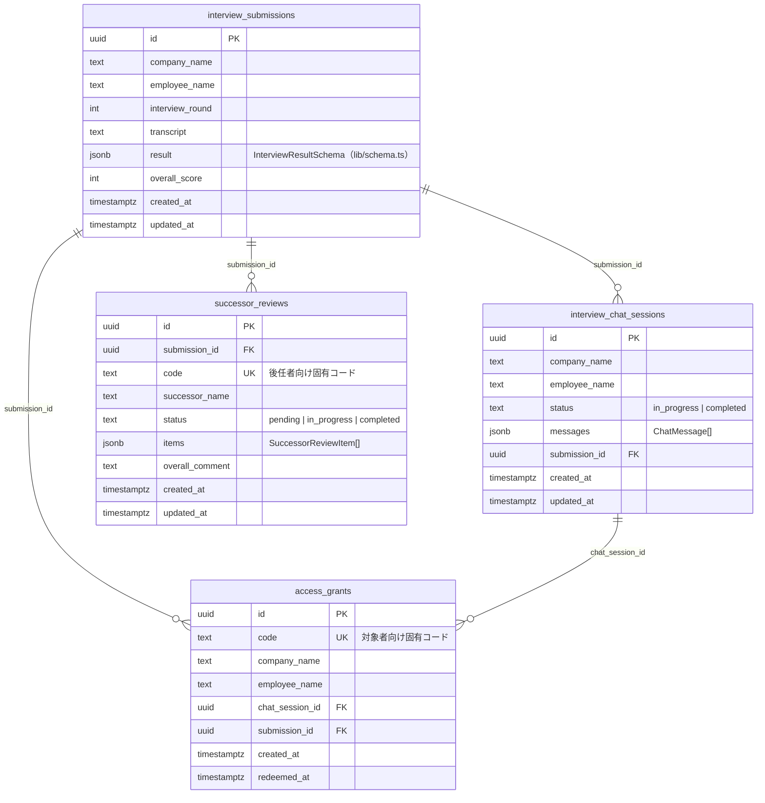

# DB設計書

対象：Supabase（Postgres）。マイグレーション本体は `supabase/migrations/`
（番号順にファイル名がついており、番号順に対象プロジェクトへ手動適用する運用。
CIによる自動適用はまだない＝`runbook.md` の「デプロイ手順」参照）。

サーバーは常に **service role key** で接続する（`lib/supabase/server.ts`）ため、
RLS（Row Level Security）は有効化してあるが、ポリシーは意図的に追加していない
（service role はRLSを常にバイパスする／anon・authenticatedロールからの直接
アクセスは全面ブロックされる。`0004_enable_rls.sql` 参照）。顧客ごとのデータ分離は
DBレベルのRLSではなく、**アプリ層の認可チェック**（`lib/authServer.ts`）で行っている。

## ER図

## テーブル定義

### interview_submissions（`0001`, `0002`）

1回のインタビュー結果（チャット版・バッチ版共通）を1行で保持する、システムの中核テーブル。
進捗・プレビュー・出力の各画面はすべてこのテーブルを共通で参照する。

| カラム | 型 | 制約 | 説明 |
|---|---|---|---|
| id | uuid | PK, `gen_random_uuid()` | |
| company_name | text | nullable | |
| employee_name | text | nullable | |
| interview_round | integer | `1〜3` | バッチ版の再質問ラウンド。チャット版は常に1 |
| transcript | text | not null | チャット版は会話ログを人が読める形に整形したもの、バッチ版は入力文字起こしそのもの |
| result | jsonb | not null | `InterviewResultSchema`（`lib/schema.ts`）。businesses配列・未完了案件・クロージングメッセージ等を丸ごと格納する構造化データの単一の正 |
| overall_score | integer | `0〜100`, nullable | `computeOverallScore()`（`lib/scoring.ts`）で算出した全業務平均。business単位のスコアは `result.businesses[].score` 内 |
| created_at | timestamptz | default now() | |
| updated_at | timestamptz | default now(), トリガーで自動更新 | プレビュー画面での編集時に更新される |

**`result` JSONBの中身**は `lib/schema.ts` の `InterviewResultSchema` が単一の正。
このドキュメントには型を書き写さない（二重管理でずれるため）。主要フィールド：
`businesses[]`（各業務。`business_type` / `system_details[]` 含む）、
`unfinished_cases[]`、`closing_message`、`re_questions[]`、`interview_round`。

### interview_chat_sessions（`0005`）

チャット版AIインタビューの、ターン単位の会話状態。完了すると `interview_submissions`
へ結果を書き出し、`status` を `completed` にする。

| カラム | 型 | 制約 | 説明 |
|---|---|---|---|
| id | uuid | PK | |
| company_name / employee_name | text | nullable | |
| status | text | `in_progress` \| `completed` | |
| messages | jsonb | not null, default `[]` | `ChatMessage[]`（`{role, content}` の配列）。毎ターンAnthropic APIへ丸ごと再送する |
| submission_id | uuid | FK → interview_submissions, nullable | 完了時のみセット |
| created_at / updated_at | timestamptz | | |

### access_grants（`0006`）

対象者（顧客）ごとに発行する固有アクセスコード。1コード = 1案件（1インタビュー）。

| カラム | 型 | 制約 | 説明 |
|---|---|---|---|
| id | uuid | PK | |
| code | text | UNIQUE, not null | `/enter/<code>` で使う10文字英数字（見間違えやすい文字は除外） |
| company_name / employee_name | text | nullable | 運営者が `/admin` で案件作成時に登録 |
| chat_session_id | uuid | FK → interview_chat_sessions, nullable | インタビュー開始時に紐付け |
| submission_id | uuid | FK → interview_submissions, nullable | インタビュー完了時に紐付け（以後このコードで進捗画面等にアクセス） |
| created_at | timestamptz | | |
| redeemed_at | timestamptz | nullable | 初回アクセス時にセット（現状、再アクセス制限には使っていない） |

### successor_reviews（`0007`）

後任者による再現性確認（仕様書5.3）。1件の引継書に対して複数発行できる
（後任者が複数人いるケースを想定）。

| カラム | 型 | 制約 | 説明 |
|---|---|---|---|
| id | uuid | PK | |
| submission_id | uuid | FK → interview_submissions, not null | |
| code | text | UNIQUE, not null | `/successor/<code>` で使う。認証Cookie不要でこのコード自体がゲート |
| successor_name | text | nullable | 現状UIからの入力導線はなく、常にnull運用（将来拡張の余地） |
| status | text | `pending` \| `in_progress` \| `completed` | `pending`→`in_progress`は業務を1件でも確認した時点で自動遷移。`completed`は後任者が明示的に「確認完了」を送信した時のみ |
| items | jsonb | not null, default `[]` | `SuccessorReviewItem[]`：`{business_name, status, question, answer, answered_at}`。発行時に対象引継書の全業務名で初期化される |
| overall_comment | text | nullable | 後任者が確認完了時に添える任意コメント |
| created_at / updated_at | timestamptz | | |

## マイグレーション適用順序と内容

| ファイル | 内容 |
|---|---|
| `0001_interview_submissions.sql` | `interview_submissions` 新規作成、`pgcrypto` 拡張有効化 |
| `0002_submission_updates.sql` | `updated_at` 列追加、`set_updated_at()` トリガー関数を定義（以後の全テーブルで再利用） |
| `0003_fix_function_search_path.sql` | `set_updated_at()` の `search_path` 固定（セキュリティ advisor 対応） |
| `0004_enable_rls.sql` | `interview_submissions` にRLS有効化（ポリシーなし＝anon/authenticated全面ブロック） |
| `0005_interview_chat_sessions.sql` | `interview_chat_sessions` 新規作成 |
| `0006_access_grants.sql` | `access_grants` 新規作成 |
| `0007_successor_reviews.sql` | `successor_reviews` 新規作成 |

新しいマイグレーションを追加する際は、この表に1行追記すること。

## 運用上の注意

- **Supabase無料プランは自動停止する**：数日アクセスがないとプロジェクトが
  `INACTIVE` になり、DB系のAPI呼び出しがタイムアウトする。`mcp__Supabase__restore_project`
  （またはSupabaseダッシュボードから）で復帰させる。詳細は `runbook.md` 既知障害③。
- **`result` / `items` 等のJSONB列は zod でしか検証されない**：DB制約（CHECK等）は
  かけていない。スキーマ変更時は `lib/schema.ts` 側を必ず `.optional().default(...)`
  で後方互換にすること（旧データが読めなくなる事故を防ぐ）。
- **本番の顧客データを長期保存する前提の削除・保存期間機能は未実装**（`docs/spec.md`
  4章）。現状は手動でSQLを実行して削除する運用。
